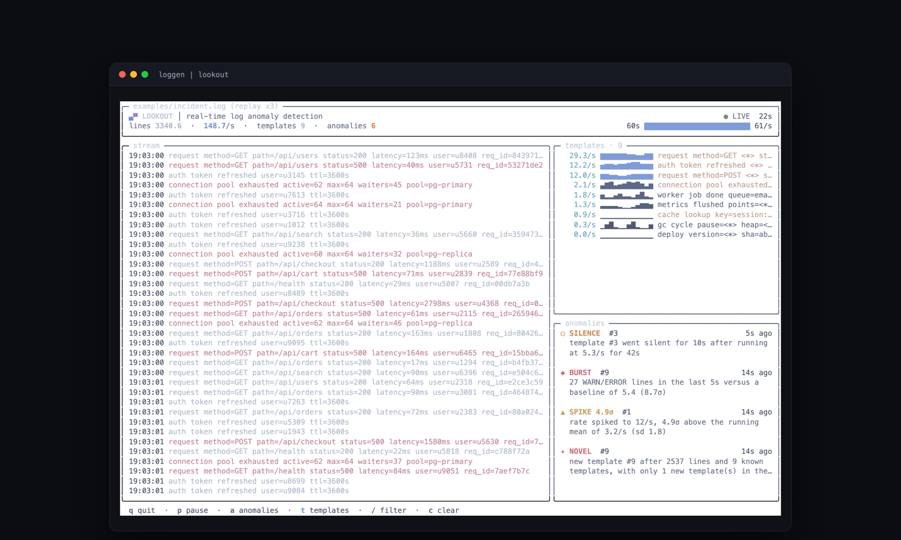
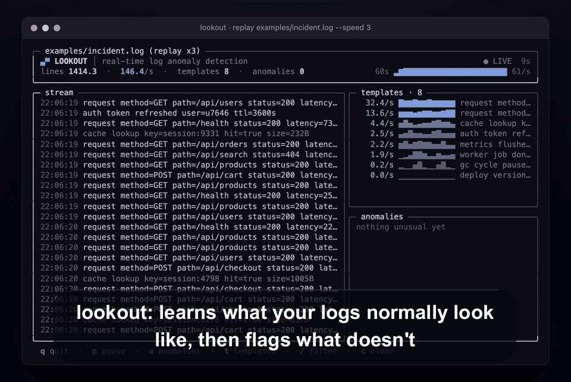

# lookout

**Real-time log anomaly detection in your terminal. No config, no training data, no service.**

```
tail -f app.log | lookout
```





## Why

`grep ERROR` finds the errors you already knew to look for. It cannot tell you that a
line you have never seen before just appeared, that a template which normally runs at
4/s stopped two minutes ago, or that checkout latency quietly went from 65ms to 1.9s
while every status code stayed 200.

lookout learns what your stream normally looks like **from the stream itself**, in one
pass, in memory, and highlights the lines that do not fit — with a sentence explaining
why. It is a single static binary with no dependencies outside the Go standard library.

## 60-second quickstart

```bash
git clone https://github.com/neelbarm/lookout && cd lookout
make build

# watch anything
tail -f /var/log/app.log | ./bin/lookout
./bin/lookout tail /var/log/app.log
kubectl logs -f deploy/api | ./bin/lookout

# offline: templates, anomalies, histogram
./bin/lookout report /var/log/install.log

# piped: one JSON object per anomaly, summary on stderr
cat app.log | ./bin/lookout --json > anomalies.jsonl
```

## Demo

```bash
make demo        # live 90s dashboard, scripted incident at t+40s
make demo-file   # writes examples/incident.log and prints the offline report
make demo-json   # the same incident through the JSON-lines path
```

The generator scripts a real outage: a novel `connection pool exhausted` template
appears, checkout latency rises 30x, the error rate bursts, the cache tier goes quiet,
auth traffic triples as sessions re-authenticate, and then everything recovers. All five
detectors fire, in the right order, within a second of t+40s. Abridged — the real
`reason` strings carry a few more numbers, and the timestamps are whenever you run it:

```
18:53:18 param    PARAM latency  latency=1.09s is 17x the median of 65ms and 5.0σ above it in log space
18:53:19 novel    NOVEL          new template #9 after 2537 lines and 9 known templates
18:53:19 spike    SPIKE 4.9σ     rate spiked to 12/s, 4.9σ above the running mean of 3.2/s
18:53:19 burst    BURST          27 WARN/ERROR lines in the last 5s versus a baseline of 5.4 (8.7σ)
18:53:28 silence  SILENCE        template #3 went silent for 10s after running at 5.3/s for 42s
```

## How it works

### 1. Drain: online template mining

Every line is stripped of its timestamp and level, masked, split on whitespace, and
routed through a fixed-depth parse tree (He et al., *Drain: An Online Log Parsing
Approach with Fixed Depth Tree*, ICWS 2017). The first level keys on **token count**,
the next levels key on the **leading tokens**; the leaf holds a short list of candidate
templates, and the line joins the most similar one above a threshold.

```
                              root
                                │
        token count ────────────┼───────────────┐
                    │                           │
                  len:7                       len:9
                    │                           │
   first token ─────┼──────┐                    │
              │            │                    │
          "request"     "cache"            "connection"
              │            │                    │
   2nd token ─┼────┐       │                    │
       │           │       │                    │
 "method=GET"  "method=POST"                    │
       │           │       │                    │
    ┌──┴──┐     ┌──┴──┐ ┌──┴──┐              ┌──┴──┐
    │leaf │     │leaf │ │leaf │              │leaf │   each leaf: a few candidate
    └──┬──┘     └─────┘ └─────┘              └─────┘   templates, scanned by similarity
       │
       ├─ #2  request method=GET <*> status=<*> latency=<*> <*> <*>      x2945
       └─ #7  request method=GET <*> upstream=<*> retry=<*> <*> <*>      x18
```

Similarity is the fraction of positions that match exactly (wildcards contribute
nothing, as in the original paper). Above `--sim` (default 0.4) the line joins that
template and any position that disagrees is widened to `<*>`; below it, a new template
is born. Masking handles UUIDs, IPv4 with ports, hex, durations (`12ms`, `1.2s`), byte
sizes, filesystem paths, URL path segments containing identifiers, and bare numbers.

Two deliberate departures from the paper, both earned on real logs:

- **The tree routes on the *masked* token, not a blanket wildcard.** Keeping
  `runningboardd[<*>]:` distinct from `mds[<*>]:` is what stops every line of a
  syslog-shaped stream from landing in one leaf. On 444k lines of `log show` output this
  is the difference between meaningful templates and `<*> <*> <*> <*>`.
- **Leaves are capped** (`MaxClusters`, default 500). Once a leaf is saturated a line
  widens the closest template instead of minting an unbounded number of near-duplicates.

### 2. The five detectors

All five are online, constant-memory, and run per second.

| Kind | Tag | Fires when |
|---|---|---|
| Novel template | `[NOVEL]` | A template appears after warm-up, while the vocabulary has otherwise settled (at most `--max-new-per-min` new templates in the last minute of stream time). |
| Rate anomaly | `[SPIKE 5.2σ]` | A template's per-second count moves `--z` sigma (default 3.5) in either direction from its EMA mean, with the dispersion floored at `sqrt(mean)` because counting noise is at least Poisson. |
| Error burst | `[BURST]` | WARN/ERROR/FATAL/panic lines in a 5-second sliding window exceed the EMA baseline by `--burst-z` sigma. |
| Parameter anomaly | `[PARAM latency]` | A numeric value at a wildcard position exceeds `--param-sigma` sigma **and** 1.5x the p99. Streaming Welford mean/variance plus a 512-sample reservoir for quantiles. |
| Silence | `[SILENCE]` | A template that ran at ≥1/s for ≥30 seconds stops for `--silence` seconds **while the rest of the stream is still flowing**. |

Four details that matter more than the thresholds:

- **Heavy tails are scored in log space.** Latencies, payload sizes and queue depths are
  right-skewed; a `mean + 4σ` rule in linear space fires on the ordinary tail several
  times an hour. When a parameter is strictly positive, lookout scores `log(v)` against
  a log-space Welford accumulator instead. This alone removed most parameter false
  positives on real traffic.
- **Baselines are winsorized.** Before folding a sample into an EMA, it is clamped to
  ±3σ. Without that, the very burst you want reported inflates the variance in the same
  second and hides itself — the error burst in the demo was invisible until this was
  fixed.
- **Identifiers are never measurements.** A position that is *ever* non-numeric, or that
  holds fewer than 20 distinct values, is not scored. That is what keeps HTTP status
  codes and hex request ids out of the parameter detector (`93e56199` parses as
  9.3 × 10⁴¹ if you hand it to a naive float parser).
- **Discontinuities are not stalls.** A jump of more than an hour between lines
  re-baselines the silence bookkeeping rather than claiming every template went quiet
  for a day.

### 3. Warm-up and hysteresis

Nothing is reported until lookout has a baseline: **500 lines, or 10 seconds of stream
time provided at least 100 lines have arrived** (a sparse file can cover ten seconds in
thirty lines, which is no baseline at all). Templates discovered during warm-up are the
vocabulary, not anomalies.

After that, each `(template, kind)` pair has a `--cooldown` window (default 8s). One
incident produces one alert per template per kind, not one per line.

## Interactive UI

Detected automatically when stdout is a terminal. Rounded panes, 24-bit colour with a
256-colour fallback and a `NO_COLOR` path, eased counters, interpolated sparklines,
anomaly lines that flash and decay over about a second, and a diff renderer that only
repaints the rows that changed.

| Key | Action |
|---|---|
| `q` | quit |
| `p` / space | pause (freezes the view, keeps processing) |
| `a` | anomalies only |
| `t` | toggle the template pane |
| `/` | filter by substring |
| `c` | clear the filter |

Resizes are handled through `SIGWINCH`, and the terminal is restored on exit, on signal
and on panic.

## CLI reference

```
tail -f app.log | lookout          watch a stream on stdin
lookout tail <file>                follow a file, handling rotation and truncation
lookout replay <file> --speed 50   replay a file using its own timestamps
lookout report <file>              offline report: templates, anomalies, histogram
lookout report -                   the same, reading stdin
```

| Flag | Default | Meaning |
|---|---|---|
| `--warmup-lines N` | 500 | lines before the detectors arm |
| `--warmup-secs N` | 10 | seconds before the detectors arm |
| `--z F` | 3.5 | z-score threshold for rate spikes |
| `--burst-z F` | 4 | z-score threshold for error bursts |
| `--sim F` | 0.4 | Drain similarity threshold |
| `--depth N` | 4 | Drain parse-tree depth |
| `--silence N` | 10 | seconds of silence before alerting |
| `--param-sigma F` | 4 | sigma multiplier for parameter outliers |
| `--max-new-per-min N` | 3 | novelty budget per minute of stream time |
| `--cooldown D` | 8s | per-template, per-kind hysteresis |
| `--json` | off | force JSON-lines output even on a terminal |
| `--no-color` | off | disable colour |
| `--quiet` | off | suppress the end-of-stream summary |
| `--from-start` | off | (`tail`) read the whole file before following |
| `--speed F` | 1 | (`replay`) replay speed multiplier |
| `--width N`, `--top N`, `--max-anomalies N` | | (`report`) output shaping |

## Output JSON schema

One object per line on stdout when stdout is not a terminal, or with `--json`:

```json
{
  "time": "2026-09-16T18:53:19-04:00",
  "kind": "burst",
  "severity": 3,
  "tag": "BURST",
  "template_id": 9,
  "template": "connection pool exhausted active=<*> max=<*> waiters=<*> <*>",
  "line": "2026-09-16T18:53:19.849-04:00 ERROR connection pool exhausted active=62 max=64 waiters=31 pool=pg-primary",
  "reason": "27 WARN/ERROR lines in the last 5s versus a baseline of 5.4 (8.7σ)",
  "score": 8.7,
  "param": "latency",
  "value": 1093
}
```

| Field | Type | Notes |
|---|---|---|
| `time` | RFC3339 | the line's own timestamp, or arrival time if it had none |
| `kind` | string | `novel`, `spike`, `burst`, `param`, `silence` |
| `severity` | 1–3 | 3 is worst |
| `tag` | string | the short label shown in the UI |
| `template_id` | int | stable within a run |
| `template` | string | the mined template |
| `line` | string | the raw line that triggered it |
| `reason` | string | one sentence, with the numbers that justify it |
| `score` | float | omitted when zero; z-score, ratio, or silence seconds |
| `param`, `value` | string, float | parameter anomalies only |

## Supported log formats

RFC3339 and ISO-8601 (including 2-digit offsets and vendor colon-milliseconds),
`YYYY-MM-DD HH:MM:SS[.frac][±ZZ[ZZ]]`, bracketed timestamps, syslog `Jan  2 15:04:05`,
nginx/Apache common and combined logs, JSON lines with `level`/`msg`/`ts`, and logfmt.
Anything else still works: the line becomes the message and arrival time becomes the
timestamp.

Escape sequences and control characters are stripped from every line before it is mined
or rendered, and invalid UTF-8 is replaced. A log you are watching is untrusted input:
without that, a line containing `ESC[2J` would clear your screen and a cursor-position
sequence would repaint the dashboard. Tabs become spaces so columns stay aligned.

## Performance

Roughly 50k lines/second single-threaded on an M-series Mac, constant memory (fixed-size
rings for recent lines and anomalies, bounded reservoirs per parameter). 444k lines of
macOS unified-log output parse and score in about 11 seconds.

## Limitations

- Templates are per-`(token count, leading tokens)`, so the same logical message split
  across different field counts becomes more than one template.
- A sustained incident eventually becomes the new baseline; parameter alerts fire on the
  leading edge, then adapt. That is the intended behaviour for an online detector, not a
  bug, but it means lookout tells you when something *changed*, not that it is still bad.
- Very diverse streams (a whole OS log) legitimately produce thousands of templates.
- A single line longer than 1 MB is truncated at that point and the rest of it discarded.
  The stream carries on; nothing downstream sees the remainder.
- No persistence: baselines live for the lifetime of the process.

## Development

```bash
make check   # gofmt, go vet, go test ./..., build
LOOKOUT_DUMP=1 go test ./internal/tui -run TestDumpFrame -v   # print a real UI frame
```

## License

MIT — see [LICENSE](LICENSE).

---

Planned by Claude Fable 5.1, built by a Claude Opus agent in one evening with Claude Code.
